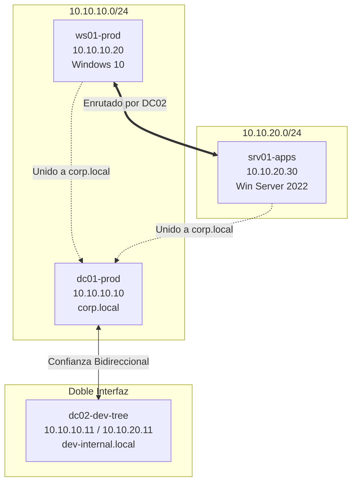

# Active Directory Security Audit Lab 🚀

Este proyecto contiene toda la **Infraestructura como Código (IaC)** necesaria para desplegar automáticamente un laboratorio de auditoría de seguridad y pruebas de penetración en Active Directory avanzado. 

El entorno consta de dos bosques de Active Directory independientes conectados mediante una relación de confianza externa bidireccional, con enrutamiento entre subredes internas, controles de seguridad desactivados (Firewall y Windows Defender) y tres vectores de ataque reales listos para auditar.

---

## 🗺️ Arquitectura de Red y Topología

El laboratorio consta de 4 máquinas virtuales que simulan una infraestructura corporativa segmentada:



### Detalle de Hardware Virtual Asignado
1. **`dc01-prod`** (Windows Server 2022): `6 GB RAM` | `2 vCPUs` | IP `10.10.10.10` en `net_corp_prod`.
2. **`dc02-dev-tree`** (Windows Server 2022): `6 GB RAM` | `2 vCPUs` | Doble interfaz: IP `10.10.10.11` en `net_corp_prod` y `10.10.20.11` en `net_dev_zone`. Actúa como enrutador.
3. **`ws01-prod`** (Windows 10 Enterprise): `4 GB RAM` | `2 vCPUs` | IP `10.10.10.20` en `net_corp_prod`.
4. **`srv01-apps`** (Windows Server 2022): `4 GB RAM` | `1 vCPU` | IP `10.10.20.30` en `net_dev_zone`.

---

## 🛠️ Requisitos Previos

Antes de desplegar el laboratorio, asegúrate de tener instalado lo siguiente en tu sistema host Linux:

1. **VirtualBox** (versión 6.1 o superior)
2. **Vagrant**
3. **Ansible**
4. **Recursos de Hardware:** Se recomienda un mínimo de **24 GB de RAM** libre en el host físico y al menos **60 GB de espacio libre en disco** (los discos virtuales son dinámicos pero las imágenes de evaluación de Windows son grandes).

---

## 🚀 Instrucciones de Despliegue

Todo el despliegue está automatizado. Simplemente sigue estos pasos:

### 1. Clonar el repositorio
Clona este repositorio en tu máquina y sitúate dentro de la carpeta:
```bash
git clone <tu-repositorio-url>
cd CreateLab-ActiveDirectory
```

### 2. Ejecutar el script de despliegue
Ejecuta el script automatizado que comprobará tus herramientas, levantará las máquinas virtuales y las aprovisionará:
```bash
./deploy.sh
```

> 💡 **Nota:** La primera vez que ejecutes esto, Vagrant descargará las imágenes oficiales de evaluación de Windows (`gusztavvargadr/windows-server-2022-standard` y `gusztavvargadr/windows-10`). Dependiendo de tu conexión de internet, esto puede tomar entre 15 y 45 minutos. Las siguientes veces iniciará en pocos minutos.

---

## 🎯 Escenarios de Vulnerabilidad Configurados

El laboratorio cuenta con tres vulnerabilidades simulando malas configuraciones reales de seguridad para fines prácticos:

### A. Abuso de Plantillas de Certificados - ESC1 (AD CS)
* **Ubicación:** `dc01-prod` (Dominio `corp.local`)
* **Detalle:** Se instala una Autoridad de Certificación corporativa (Enterprise CA). Se clona la plantilla clásica de `User` en una plantilla llamada `CorporateVPN` modificando su atributo `msPKI-Certificate-Name-Flag` a `1` (que activa la opción `ENROLLEE_SUPPLIES_SUBJECT`).
* **Vía de Explotación:** Cualquier usuario estándar del dominio puede solicitar un certificado digital bajo esta plantilla e inyectar un nombre alternativo del sujeto (SAN) apuntando a un Administrador del Dominio, obteniendo un certificado válido que permite autenticarse como Administrador.

### B. Credenciales en Registro AutoLogon
* **Ubicación:** `ws01-prod` (Windows 10)
* **Detalle:** Se crea la cuenta de soporte `helpdesk_svc` en el dominio. Se simula una mala configuración de inicio de sesión automático inyectando sus credenciales de texto plano en las claves del registro de Windows NT Winlogon.
* **Vía de Explotación:** Al obtener acceso a la máquina ws01-prod (o leyendo el registro de forma remota si hay permisos), un auditor puede extraer las siguientes credenciales:
  * **Usuario:** `helpdesk_svc`
  * **Contraseña:** `S3cur3P@ssw0rd!2026`
  * **Dominio:** `corp`

### C. Kerberoasting (Cuenta de Servicio con SPN)
* **Ubicación:** `srv01-apps` (Windows Server 2022 / Dominio `corp.local`)
* **Detalle:** Se crea la cuenta de usuario de dominio `svc_mssql` con una contraseña débil (`Password123!`). Posteriormente, se le asocia el Service Principal Name (SPN) `MSSQLSvc/srv01-apps.corp.local:1433`.
* **Vía de Explotación:** Cualquier usuario autenticado en el dominio puede solicitar un ticket de servicio TGS para dicho SPN. Al obtener el ticket (que está cifrado con el hash de la contraseña de `svc_mssql`), se puede extraer de la memoria y crackear localmente (offline) con herramientas como `hashcat` o `John the Ripper` para descifrar la contraseña.

---

## 🔒 Acceso y Credenciales

### Acceso Visual
Aunque las máquinas se inician en segundo plano (headless) para optimizar el host, puedes ver la pantalla y controlarlas gráficamente abriendo la app de **VirtualBox** y haciendo doble clic en la máquina deseada o pulsando **"Mostrar"**.

### Cuentas y Contraseñas
* **Administrador del Dominio / Local (DC01 y DC02):** `Administrator` / `vagrant`
* **Cuenta Helpdesk (AutoLogon):** `helpdesk_svc` / `S3cur3P@ssw0rd!2026`
* **Cuenta SQL (Kerberoasting):** `svc_mssql` / `Password123!`

---

## 🧹 Limpiar el Laboratorio

Cuando termines tus pruebas y desees apagar y borrar por completo las máquinas virtuales de tu disco duro para liberar espacio, ejecuta:

```bash
vagrant destroy -f
```
Esto eliminará las 4 VMs de tu VirtualBox de forma definitiva. Tus archivos de configuración en el host se mantendrán intactos para cuando quieras volver a levantarlas.
