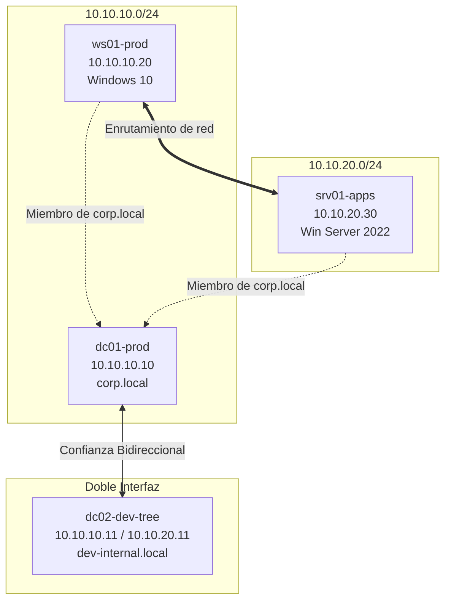
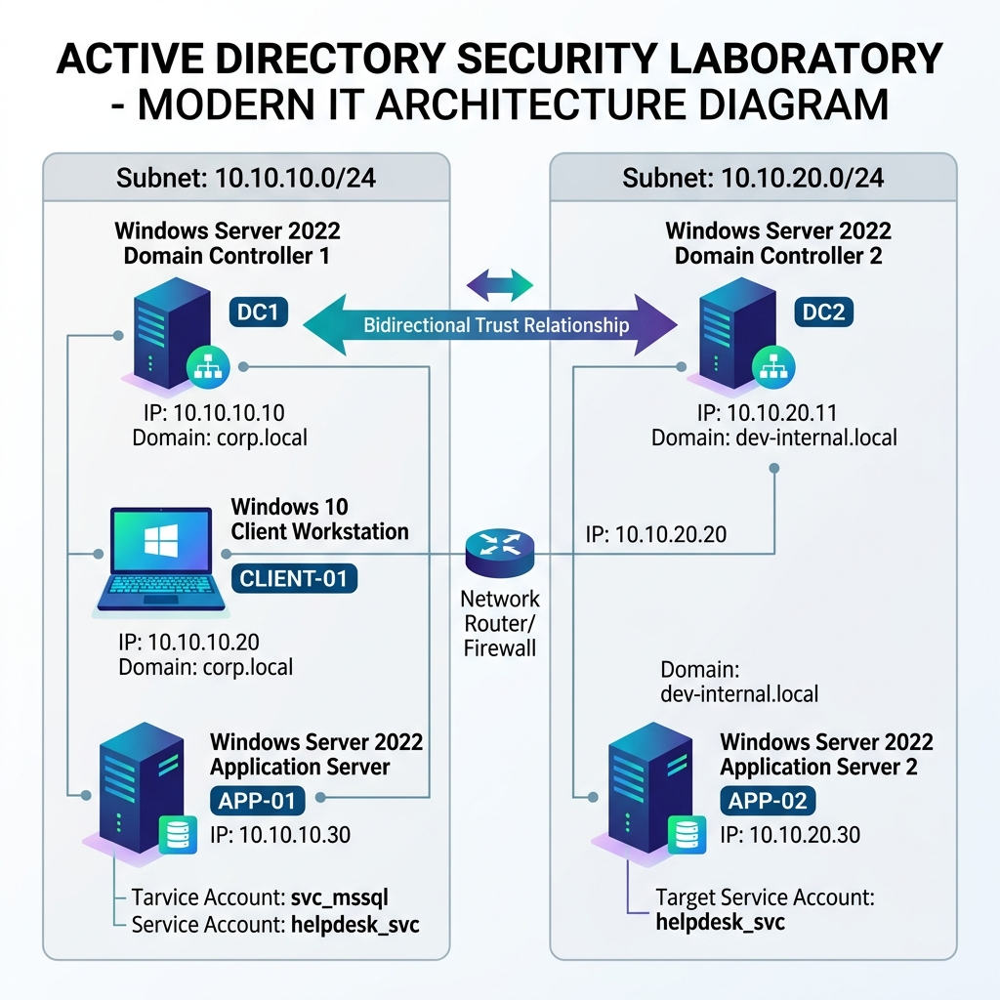

# Laboratorio de Auditoria de Seguridad en Active Directory

Este proyecto proporciona la configuracion de Infraestructura como Codigo (IaC) necesaria para el despliegue automatizado de un entorno de pruebas y auditoria de Active Directory. 

El entorno simula una infraestructura corporativa compuesta por dos bosques independientes conectados mediante una relacion de confianza externa bidireccional, enrutamiento entre subredes internas, exclusion de controles locales (Firewall de Windows y Windows Defender) y tres vectores de ataque configurados para simulaciones de seguridad.

---

## Arquitectura de Red y Topologia

El laboratorio esta compuesto por cuatro maquinas virtuales distribuidas en dos subredes de red internas aisladas, interconectadas a traves de una maquina con doble interfaz de red que realiza funciones de enrutamiento:



A continuacion se presenta el diagrama de arquitectura detallado con el flujo de datos y las relaciones de confianza:



### Maquinas Virtuales y Hardware Asignado
1. **dc01-prod** (Windows Server 2022): 6 GB de Memoria RAM, 2 vCPUs y direccion IP estatica 10.10.10.10 en la red net_corp_prod. Controlador de dominio para corp.local.
2. **dc02-dev-tree** (Windows Server 2022): 6 GB de Memoria RAM, 2 vCPUs y doble interfaz de red (10.10.10.11 en net_corp_prod y 10.10.20.11 en net_dev_zone). Controlador de dominio para dev-internal.local y enrutador IP.
3. **ws01-prod** (Windows 10 Enterprise): 4 GB de Memoria RAM, 2 vCPUs y direccion IP estatica 10.10.10.20 en la red net_corp_prod. Estacion de trabajo unida a corp.local.
4. **srv01-apps** (Windows Server 2022): 4 GB de Memoria RAM, 1 vCPU y direccion IP estatica 10.10.20.30 en la red net_dev_zone. Servidor de aplicaciones unido a corp.local.

---

## Requisitos del Sistema

Para el correcto despliegue del entorno, el host Linux debe contar con las siguientes herramientas instaladas:

1. **VirtualBox** (version 6.1 o posterior)
2. **Vagrant**
3. **Ansible**
4. **Hardware del Sistema:** Se requiere un minimo de 24 GB de Memoria RAM en el host y al menos 60 GB de espacio de almacenamiento en disco disponible.

---

## Instrucciones de Despliegue

El aprovisionamiento de las maquinas y servicios esta completamente automatizado. Para iniciar el laboratorio, realice los siguientes pasos:

### 1. Clonar el repositorio
Clone este repositorio de forma local y acceda a la carpeta del proyecto:
```bash
git clone <url-del-repositorio>
cd CreateLab-ActiveDirectory
```

### 2. Ejecutar el script de inicializacion
Asigne permisos de ejecucion y ejecute el script de despliegue:
```bash
./deploy.sh
```

El script verificara la presencia de las dependencias requeridas en el host, iniciara las maquinas virtuales a traves de Vagrant, comprobara la conexion de administracion remota (WinRM) y ejecutara los playbooks de Ansible para configurar las directivas, los dominios y los vectores de ataque.

---

## Escenarios de Vulnerabilidad Implementados

El laboratorio cuenta con tres vectores de ataque reales configurados especificamente para entrenamiento en auditoria de seguridad:

### A. Abuso de Plantillas de Certificados - ESC1 (AD CS)
* **Objetivo:** dc01-prod (Dominio corp.local)
* **Configuracion:** Se instala una Autoridad de Certificacion (Enterprise Root CA). Se realiza una copia de la plantilla por defecto User bajo el nombre CorporateVPN, modificando el atributo msPKI-Certificate-Name-Flag a 1 (lo que activa la propiedad ENROLLEE_SUPPLIES_SUBJECT).
* **Vectores de Auditoria:** Esta configuracion permite que cualquier usuario autenticado dentro del dominio solicite un certificado e indique un nombre alternativo de sujeto (SAN) arbitrario (por ejemplo, el administrador del dominio), logrando la suplantacion de identidad para autenticacion en el dominio.

### B. Credenciales en Registro AutoLogon
* **Objetivo:** ws01-prod (Windows 10)
* **Configuracion:** Se crea la cuenta de usuario de dominio helpdesk_svc en corp.local. Se habilita el inicio de sesion automatico en la estacion de trabajo ws01-prod, almacenando las credenciales en texto plano dentro de la clave del registro HKLM:\SOFTWARE\Microsoft\Windows NT\CurrentVersion\Winlogon.
* **Vectores de Auditoria:** Al comprometer la maquina (o acceder al registro mediante consultas remotas si existen privilegios), un auditor puede extraer las credenciales del operador de soporte tecnico del dominio.

### C. Kerberoasting (Cuentas de Servicio con SPN)
* **Objetivo:** srv01-apps (Windows Server 2022)
* **Configuracion:** Se crea una cuenta de servicio de dominio llamada svc_mssql en corp.local con una contraseña vulnerable de baja complejidad (Password123!). Se le asigna el Service Principal Name (SPN) MSSQLSvc/srv01-apps.corp.local:1433.
* **Vectores de Auditoria:** Al solicitar un ticket de servicio Kerberos (TGS) para esta cuenta desde cualquier maquina unida al dominio, el ticket cifrado con la clave de la cuenta svc_mssql puede ser extraido de memoria y descifrado mediante tecnicas de cracking offline (como hashcat o John the Ripper).

---

## Referencia de Credenciales

| Servidor / Recurso | Tipo de Cuenta | Nombre de Usuario | Contrasena |
| :--- | :--- | :--- | :--- |
| Entorno General | Administrador Local / Dominio | Administrator | vagrant |
| Soporte Tecnico (AutoLogon) | Usuario de Dominio (corp) | helpdesk_svc | S3cur3P@ssw0rd!2026 |
| Base de Datos (Kerberoasting) | Usuario de Dominio (corp) | svc_mssql | Password123! |

---

## Desmantelamiento del Entorno

Para apagar y eliminar todas las maquinas virtuales creadas en VirtualBox para liberar recursos del host, ejecute el siguiente comando desde la carpeta del proyecto:

```bash
vagrant destroy -f
```
Esto eliminara las instancias del hipervisor, manteniendo el codigo fuente intacto para despliegues posteriores.
