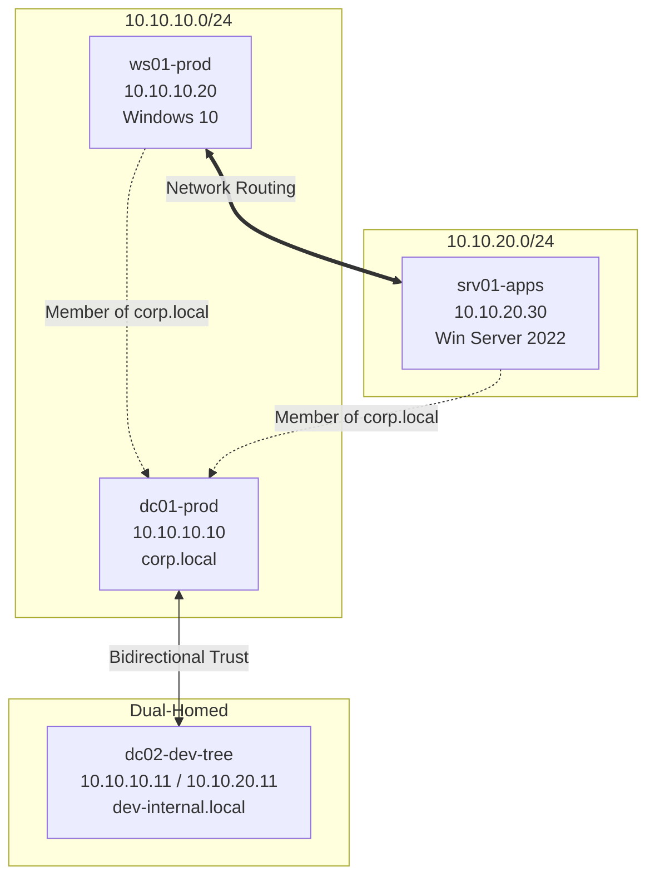

# uv3dobleAD-1

This repository contains the Infrastructure as Code (IaC) configuration required to automatically deploy an Active Directory security auditing and testing laboratory.

The environment simulates an enterprise infrastructure consisting of two independent forests connected via a bidirectional external trust relationship, network routing between internal subnets, disabled local security controls (Windows Firewall and Windows Defender), and three pre-configured attack paths for security simulations.

---

## Network Architecture and Topology

The laboratory is composed of four virtual machines distributed across two isolated internal subnets, interconnected through a dual-homed virtual machine performing routing functions:



### Virtual Machines and Hardware Allocation
1. **dc01-prod** (Windows Server 2022): 6 GB RAM, 2 vCPUs, and static IP address 10.10.10.10 on the net_corp_prod network. Primary domain controller for corp.local.
2. **dc02-dev-tree** (Windows Server 2022): 6 GB RAM, 2 vCPUs, and dual network interfaces (10.10.10.11 on net_corp_prod and 10.10.20.11 on net_dev_zone). Domain controller for dev-internal.local and IP router.
3. **ws01-prod** (Windows 10 Enterprise): 4 GB RAM, 2 vCPUs, and static IP address 10.10.10.20 on the net_corp_prod network. Workstation joined to corp.local.
4. **srv01-apps** (Windows Server 2022): 4 GB RAM, 1 vCPU, and static IP address 10.10.20.30 on the net_dev_zone network. Application server joined to corp.local.

---

## System Prerequisites

To deploy the environment, the Linux host must have the following tools installed:

1. **VirtualBox** (version 6.1 or later)
2. **Vagrant**
3. **Ansible**
4. **Hardware Requirements:** A minimum of 24 GB RAM on the host and at least 60 GB of available disk storage.

---

## Deployment Instructions

The provisioning of all virtual machines and services is fully automated. To spin up the laboratory, follow these steps:

### 1. Clone the repository
Clone this repository locally and navigate to the project directory:
```bash
git clone https://github.com/uv3doble/uv3dobleAD-1.git
cd uv3dobleAD-1
```

### 2. Execute the initialization script
Grant execution permissions and run the deployment script:
```bash
./deploy.sh
```

The script will verify the presence of all required host dependencies, initiate the virtual machines via Vagrant, test remote management connectivity (WinRM), and execute the Ansible playbooks to configure domains, policies, and vulnerability vectors.

---

## Implemented Vulnerability Scenarios

The laboratory features three real-world vulnerability paths configured for security audit training:

### A. Certificate Template Misconfiguration - ESC1 (AD CS)
* **Target:** dc01-prod (Domain corp.local)
* **Configuration:** An Enterprise Root CA is installed. The default User certificate template is cloned under the name CorporateVPN, with the msPKI-Certificate-Name-Flag attribute modified to 1 (enabling the ENROLLEE_SUPPLIES_SUBJECT property).
* **Audit Vector:** This allows any authenticated domain user to request a certificate and supply an arbitrary Subject Alternative Name (SAN) (e.g., the Domain Administrator), achieving full identity spoofing and domain takeover.

### B. Exposed Registry AutoLogon Credentials
* **Target:** ws01-prod (Windows 10)
* **Configuration:** A domain user account named helpdesk_svc is created in corp.local. Automatic logon is enabled on ws01-prod, storing the credentials in plaintext within the registry key HKLM:\SOFTWARE\Microsoft\Windows NT\CurrentVersion\Winlogon.
* **Audit Vector:** Upon compromising the workstation (or query the registry remotely if appropriate permissions are met), an auditor can retrieve the administrative operator credentials.

### C. Kerberoasting (Service Account with SPN)
* **Target:** srv01-apps (Windows Server 2022)
* **Configuration:** A domain service account named svc_mssql is created in corp.local with a weak password (Password123!). The Service Principal Name (SPN) MSSQLSvc/srv01-apps.corp.local:1433 is registered and mapped to it.
* **Audit Vector:** Any authenticated domain user can request a Kerberos ticket-granting service (TGS) ticket for this SPN. The ticket, encrypted with the hash of the svc_mssql account, can be dumped from memory and cracked offline using hashcat or John the Ripper.

---

## Credentials Reference

| Target Server / Resource | Account Type | Username | Password |
| :--- | :--- | :--- | :--- |
| General Environment | Local Administrator / Domain Admin | Administrator | vagrant |
| Helpdesk Operator (AutoLogon) | Domain User (corp.local) | helpdesk_svc | S3cur3P@ssw0rd!2026 |
| Database Service (Kerberoasting) | Domain User (corp.local) | svc_mssql | Password123! |

---

## Tearing Down the Environment

To shut down and completely delete all virtual machines from VirtualBox to free up host resources, run the following command from the project folder:

```bash
vagrant destroy -f
```
This command deletes the hypervisor instances while keeping the source code intact for future deployments.
